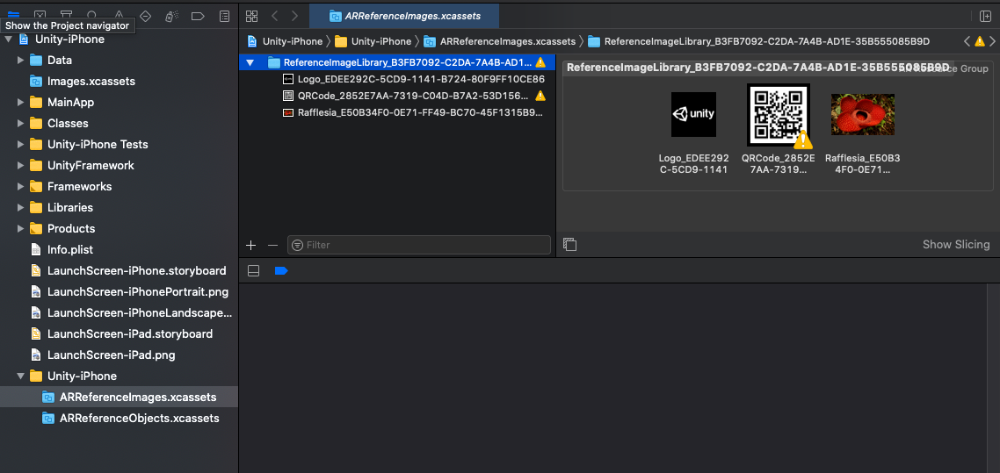

# Image tracking

To use image tracking on ARKit, you first need to create a Reference Image Library. See the [AR Subsystems documentation on image tracking](xref:arsubsystems-image-tracking-subsystem) for instructions.

During an iOS player build, this package compiles the reference image libraries into the necessary runtime data required by ARKit. There are two ways this can be done:

1. This package attempts to run a command line tool which generates the binary data. This data is then added to the [XRReferenceImageLibrary](xref:UnityEngine.XR.ARSubsystems.XRReferenceImageLibrary) asset. This technique requires macOS with Xcode installed.
1. This package can also create an AR Resource Group in the generated Xcode project:
 The resource group and the images within it are named according to the name the user specifies in the Unity Editor concatenated with a GUID so the image can be uniquely identified at runtime.
 This process can be performed on any desktop platform.

> [!NOTE]
> **Using reference image libraries with asset bundles**
>
> 
In order to use an XRReferenceImageLibrary in an [asset bundle](xref:AssetBundlesIntro), the asset bundle must be built on macOS with Xcode installed. This is because technique #2 mentioned above builds the reference images into the Player, not the XRReferenceImageLibrary asset.

## Image format requirements

ARKit's AR Reference Images can be either JPEG or PNG files. If a different type of source texture is specified in the `XRReferenceImageLibrary`, then we attempt to convert the texture to a PNG for ARKit to use. Exporting a `Texture2D` to PNG can fail for several reasons. For instance, the texture must be marked both readable and uncompressed in the texture importer settings. Note that if you plan to use the texture at runtime (and not just as a source asset for the reference image), you should create a separate PNG or JPEG as the source asset, because those texture import settings can have undesirable performance or memory impacts at runtime.

If you plan to use the texture at runtime (and not just as a source asset for the reference image), you should create a separate PNG or JPEG as the source asset, because those texture import settings can have undesirable performance or memory impacts at runtime.

## Reference image dimensions

ARKit requires image dimensions. When you specify the dimensions for a reference image, only the image's width is provided to ARKit. Xcode computes the height from the image's aspect ratio.
